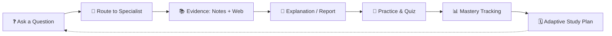

# 🧠 ESC — Enhanced Study Companion

**One question. The right specialist. A clearer next step.**

---

## ✨ What is ESC?

A single workspace that takes a student from **question → explanation → practice → plan** — instead of juggling a chat tool, a search engine, a flashcard app, and a planner separately.

---

## 🧩 Core Workspaces

| 💬 Chat | 🎓 Studio | 📈 Adaptive Learning |
|:---:|:---:|:---:|
| Streaming conversational AI with optional sources & specialist role | Multi-specialist research & report generation workflow | Diagnostics → mastery scores → versioned study schedules |

---

## 🤖 12 Specialist Agents

| Agent | Role |
|---|---|
| 🗂️ **StudyVault** | Organise notes, chapters & syllabi |
| 📊 **ExamInsight** | Interpret performance evidence |
| 🏗️ **SuccessArchitect** | Build a personal study plan |
| 💡 **Concept Clarifier** | Explain difficult concepts |
| ➗ **Problem Solver** | Step-by-step problem solving |
| ❓ **QuizForge** | Generate original practice questions |
| 🔁 **Revision Coach** | Guide recall & revision sessions |
| 🃏 **Flashcard Studio** | Concept → Q/A flashcards |
| 🧠 **MindMap Maker** | Visual concept relationships |
| 🔎 **Resource Scout** | Curate learning resources |
| 📄 **Paper Pattern Analyst** | Analyse past papers |
| 🎯 **GuideMinds** | Focus & routine support |

---

## 🛠️ Tech Stack

| Layer | Technology |
|---|---|
| 🧠 Orchestration | Google **Agent Development Kit (ADK)** — 12-agent system |
| ⚡ Core AI | Google **Gemini** |
| ☁️ Model Ops | **Vertex AI** · **Google AI Studio** |
| 🔐 Auth / DB / Hosting | **Firebase** |
| 🎨 UI Generation | **Google Antigravity** · **Google Stitch** |
| 🧑‍💻 Backend Acceleration | **OpenAI Codex** |
| 🗄️ Storage | **Google Cloud Storage** |
| 🚢 Deployment | **Render** (FastAPI backend) |
| 🖥️ Frontend | **React + TypeScript** |
| 🔌 Backend | **FastAPI** |

---

## 🌐 Live App

### 👉 [esc-study-companion-web.onrender.com](https://esc-study-companion-web.onrender.com/)

> ⚠️ Hosted on Render's free tier — the backend may take a few seconds to wake up on first load.

---

## 📌 Status

Actively developed — current deployment is a working prototype for testing and demonstration.

Made with 🧠 + ☕ for students who want one place to learn, not five.

